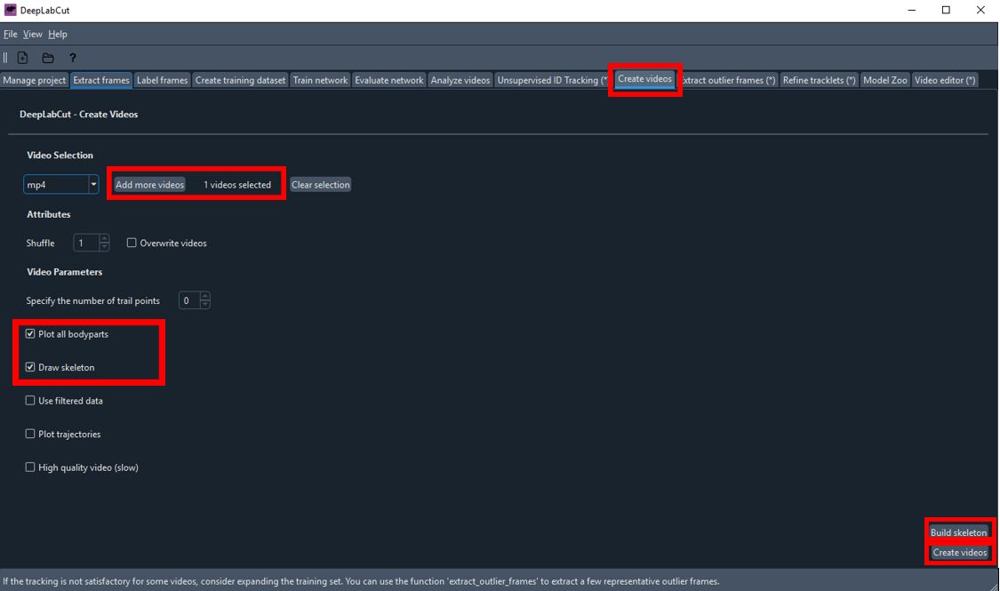

# DLC-based-behavioral-analysis

This repository contains code and documentation for using DeepLabCut (DLC) to analyze the behavior of animals. Specifically, the code in this repository provides a pipeline for using DLC to track the movement of animal paws and analyze their behavior.

## DeepLabCut Windows Installation Guide

This section guides you through a step-by-step process to install DeepLabCut on a Windows machine. DeepLabCut is an open-source package primarily used for markerless pose estimation of animals in videos.

### Installation Steps

#### 1. Download Anaconda:

Anaconda is a free and open-source distribution of Python and R, primarily used for scientific computing. It simplifies package management and deployment. You can download and install Anaconda from [here](https://www.anaconda.com).

   

#### 2. Download the Conda Environment File:

Download the Conda environment file [`DLC-CPU.yaml`](https://github.com/neurobiologylab/dlc-based-behavioral-analysis/blob/main/env/DLC-CPU.yaml).

#### 3. Create a New Folder:

Create a new folder named "DeepLabCut" in your preferred workspace directory.

#### 4. Launch Anaconda Navigator:

Start the Anaconda Navigator application.

#### 5. Launch CMD.exe Prompt:

In the Anaconda Navigator, launch the "CMD.exe Prompt" which will open a new command prompt window.

   

#### 6. Navigate to the Workspace:

In the command prompt window, navigate to your "DeepLabCut" directory. For example, if your "DeepLabCut" folder is in the root of the C drive, you would type:

   ```
   cd C:\your_workspace_directory\DeepLabCut
   ```

#### 7. Create the Conda Environment:

In the "DeepLabCut" directory, use the downloaded `.yaml` file to create a new Conda environment:

   ```
   conda env create -f DLC-CPU.yaml
   ```

   

#### 8. Activate the New Environment:

Activate the new Conda environment with:

   ```
   conda activate DEEPLABCUT
   ```

#### 9. Launch a DeepLabCut Session:

Initiate a DeepLabCut session using the command prompt:

   ```
   python -m deeplabcut
   ```

For more installation tips, visit the [official DeepLabCut documentation](https://deeplabcut.github.io/DeepLabCut/docs/recipes/installTips.html).


## DeepLabCut Usage Guide

This guide provides detailed instructions on how to use DeepLabCut (DLC) for your video analysis tasks.

### Steps

1. **Start DeepLabCut**: 

    Launch the "CMD.exe Prompt" from Anaconda Navigator, and enter the following commands:

    ```
    conda activate DEEPLABCUT
    python -m deeplabcut
    ```
    This will open the DeepLabCut welcome window.

   

2. **Create a new project**: 

    Click on `Create New Project` on the welcome page. 

    - Fill out the project name and experimenter name, then check the `Copy videos to project folder` checkbox.
    - Do not use the `Browse videos` button which does work(bug). Use **drag & drop** to add your videos. Note: DLC may not recognize MPEG files correctly, so it's recommended to use MP4 files. Ensure that you don't change the video file location after this step.
    - Once all fields are filled, click `Create`.

   

3. **Edit Configuration File**: 

    - Locate the `Config.yaml` file in your project directory and open it.
    - Replace the `bodyparts` list with the labels you want to use for your project. 
    - The `numframes2pick` parameter specifies the number of frames to extract for labeling. For accurate analysis, it is recommended to pick a couple hundred frames.
    - The `skeleton` parameter represents the connections between each label. These connections will be displayed in the final video.
    - Save your changes (Ctrl+S) and verify them by clicking the `Edit Config.yaml` button in DeepLabCut.

    
   

   
   

   You can click the "Edit config.yaml" button to verify that the list has been updated.

   

   
   

4. **Extract Frames**: 

    Navigate to the `Extract Frames` tab in DeepLabCut. 

    - You can keep the default settings.
    - You can crop the frame by select the `GUI` from `Frame cropping` and draw a rectangle around the area of interest in the GUI, then click `Crop`.

   

   

    - Once you're done, `Extract Frames` will be running. When it is done, click `ok` and go to the next step.
    
   


5. **Label Frames**: 

    Navigate to the `Label Frames` tab. 

    - Click the `Label Frames` button to open the frame labeling interface.   

   

    - Load the frames you extracted in the previous step.

   

The labeling interface offers several features that make the task of labeling your images more convenient and efficient. Here's a quick rundown of each feature:

- **Image Display Area**: This is where your selected image is displayed for labeling. 

- **+ Button**: This button is used to mark a new label on the image. You can use either left or right mouse clicks.

- **Arrow Button**: This button is used to select an existing label and either reposition or delete it. Multiple points can be selected and repositioned or deleted simultaneously.

- **Navigation Bar**: This tool or your keyboard's arrow keys can be used to navigate through images, moving to the next or previous image with ease.

- **Lock Selection**: This feature is particularly useful when you have multiple points to label on each frame, such as 'head', 'frontpaw', 'backpaw', and 'tail'. If you lock the selection, for example, to 'head', as you navigate to any other frame using the navigation bar, 'head' will be automatically selected for labeling. On the other hand, if you unlock the selection, the labeling process will proceed in the default order 'head' > 'frontpaw' > 'backpaw' > 'tail' as you move to the next frame.

- **Save Button (Ctrl+S)**: Regularly save your changes to prevent any potential data loss. You can do this by clicking the Save button or by using the shortcut `Ctrl+S`.

- **Post-Labeling Verification**: After you have completed the labeling process, your annotated data will be saved in both CSV and H5 formats. These files, which contain the coordinates of the labels for each frame of your videos, can be found in the labeled-data directory within your project folder (named after your video file). Checking these files ensures that your labels have been saved correctly.

Understanding and effectively using these features can significantly streamline your labeling process, contributing to the overall accuracy and efficiency of your DeepLabCut project.

   


   

6. **Create a Training Dataset**: 

    Navigate to the `Create Training Dataset` tab. 

    - **Shuffle**: This option determines whether the training samples are shuffled.
    - **Network architecture**: Choose the appropriate model architecture based on your requirements:

        - **ResNet (Residual Networks)**: Known for "skip connections" and deep layers, ResNet effectively mitigates the vanishing gradient problem, making it suitable for complex tasks like image classification. However, it's computationally expensive and large in size.

        - **MobileNet**: Designed for mobile and embedded vision applications, MobileNet is computationally efficient and small in size due to its use of depthwise separable convolutions. It's a go-to choice for resource-constrained applications.

        - **EfficientNet**: With a balance of accuracy and computational efficiency, EfficientNet uses compound scaling and an improved version of MobileNet's depthwise convolution. It provides state-of-the-art accuracy while remaining small and fast.

    - **Augmentation method**: Select the image augmentation method. Augmentation techniques such as tensorpack and imgaug can provide variation to your training data, enhancing the model's ability to generalize.
     
    You can keep the default settings, or select particular network and augmentation method depend on your needs. after you choose the settings, click `Create Training Dataset`. 

   

7. **Train the Network**: 

    Navigate to the `Train Network` tab. 

    - `Display iterations`: This determines how frequently the training status is displayed in terminal(shell window).  
    - `Save iterations`: This dictates how often the state of the trained network is saved.
    - `Maximum iterations`: This is the total number of iterations that the training process should complete. 

    After setting these parameters, click `Start Training`. The training procedure will take some time to finish. You can keep track of its progress in the Anaconda Prompt. Once the training is finished, a completion notification window will pop up. Click 'OK' on this window to proceed to the next step.
    
   

   
   

8. **Evaluate the Network**: 

    Navigate to the `Evaluate Network` tab. 

    - Check both `Plot predictions` and `compare all bodyparts` options.
    - Click `Evaluate Network`.

   
   
   

9. **Analyze Videos**: 

    Navigate to the `Analyze Videos` tab. 

    - Click `Select videos` and choose the videos you want to analyze.
    - Ensure `save_as_csv` is checked.
    - Click `Analyze Videos`.

   

   

   

10. **Create Labeled Videos**: 

    Navigate to the `Create Videos` tab. 

    - Add the videos you analyzed in the previous step. The system will typically select the videos automatically, if not, you can manually add the videos in the same manner as in previous step.
    - Check both `Plot all body parts` and `Draw skeleton` options.
    - Click on the `Build Skeleton` button to validate that the points are properly connected, then close the pop-up window.
    - Finally, click on `Create Videos`. The system will now generate the labeled videos for you.
    
   
    
   
    
   
    
   

11. **Extract Outliers (optional)**: 

    If the analysis results are not satisfactory, navigate to the `Extract Outlier Frames` tab. 

    - Add the videos you want to refine.
    - Specify the extraction algorithm. If you choose `manual`, a new interface will open, allowing you to go through each frame of the video and mark frames that need to be relabeled.
    - Click `Extract Outlier Frames`.
    
   

12. **Refine Labels (optional)**: 

    If you have outlier frames, navigate to the `Refine Labels` tab. 

    - Load the frames, move the mislabeled points to their correct positions, then save your changes.
    - You can verify your changes by checking the `CollectedData_YourName.csv` file in the `labeled-data/video_name` directory in your project folder.
    - Once you're done, click `Merge datasets`.
    
   
    
   

Congratulations! You have successfully used DeepLabCut to analyze your videos. For further analysis, you can import the CSV files created during the analysis into your preferred data analysis software.


## Usage

To use this code, you must first create a DLC project for your animal behavior data. Once you have created a project and labeled your data, you can use the scripts in this repository to analyze the data and generate visualizations.

The main script for analyzing the data is `analyze_behavior.ipynb`, which takes a DLC project file as input and outputs data on paw movement and behavior. The script generates various visualizations to help you understand the data, including time series plots of paw movement and behavioral analysis plots.

## Contributing

Contributions to this project are welcome. If you find a bug or have a suggestion for how to improve the code, please open an issue or submit a pull request.

