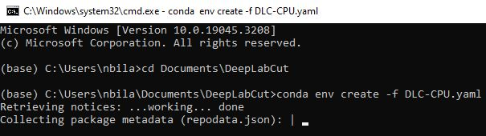

# DLC-based-behavioral-analysis

This repository contains code and documentation for using DeepLabCut (DLC) to analyze the behavior of animals. Specifically, the code in this repository provides a pipeline for using DLC to track the movement of animal paws and analyze their behavior.

## DeepLabCut Windows Installation Guide

This section guides you through a step-by-step process to install DeepLabCut on a Windows machine. DeepLabCut is an open-source package primarily used for markerless pose estimation of animals in videos.

### Installation Steps

#### 1. Download Anaconda:

Anaconda is a free and open-source distribution of Python and R, primarily used for scientific computing. It simplifies package management and deployment. You can download and install Anaconda from [here](https://www.anaconda.com/distribution/).

   

#### 2. Download the Conda Environment File:

Visit the [DeepLabCut's homepage](http://www.mackenziemathislab.org/deeplabcut) and download the Conda environment file (`.yaml`). You can find the download button at the bottom of the page.

   

#### 3. Create a New Folder:

Create a new folder named "DeepLabCut" in your preferred workspace directory.

#### 4. Launch Anaconda Navigator:

Start the Anaconda Navigator application.

#### 5. Launch CMD.exe Prompt:

In the Anaconda Navigator, launch the "CMD.exe Prompt" which will open a new command prompt window.

   

#### 6. Navigate to the Workspace:

In the command prompt window, navigate to your "DeepLabCut" directory. For example, if your "DeepLabCut" folder is in the root of the C drive, you would type:

   ```
   cd C:\your_workspace_directory\DeepLabCut
   ```

#### 7. Create the Conda Environment:

In the "DeepLabCut" directory, use the downloaded `.yaml` file to create a new Conda environment:

   ```
   conda env create -f DEEPLABCUT.yaml
   ```

   

#### 8. Confirm Python.exe Installation:

If prompted, enter your administrator password to confirm the installation of "python.exe".

#### 9. Activate the New Environment:

Activate the new Conda environment with:

   ```
   conda activate DEEPLABCUT
   ```

#### 10. Launch a DeepLabCut Session:

Initiate a DeepLabCut session using the command prompt:

   ```
   ipython
   import deeplabcut
   deeplabcut.launch_dlc()
   ```

Your command prompt should appear as:
   ```
   (DEEPLABCUT) C:\Users\YourUserName>ipython
   Python 3.8.10 | packaged by conda-forge | (default, May 11 2021, 06:25:23) [MSC v.1916 64 bit (AMD64)]
   Type 'copyright', 'credits' or 'license' for more information
   IPython 7.25.0 -- An enhanced Interactive Python. Type '?' for help.

   In [1]: import deeplabcut

   In [2]: deeplabcut.launch_dlc()
   ```

   ```
   python -m deeplabcut
   ```

#### 10.5 https://schoolforengineering.com/tutorial/install-tensorflow-cuda-gpu-windows-10/

#### 11. Verify Successful Installation:

If everything has been installed correctly, the DeepLabCut GUI should now appear.

#### 12. Troubleshoot TensorFlow Installation:

If you encounter an error stating "No module named 'tensorflow'", you may need to install TensorFlow using the following commands:
   ```
   pip install --upgrade pip
   pip install tensorflow
   ```

For more installation tips, visit the [official DeepLabCut documentation](https://deeplabcut.github.io/DeepLabCut/docs/recipes/installTips.html).

#### Docker Install:

##### Prerequisites

Before proceeding with the installation, make sure you have the following prerequisites set up on your Windows machine:

- [Linux installation with WSL 2](https://learn.microsoft.com/en-us/windows/wsl/install)
- [Docker Desktop for Windows](https://www.docker.com/products/docker-desktop/)

1. Open the Ubuntu(22.04) subsystem installed with WSL 2.

2. Install the DeepLabCut helper package by running the following command in the Ubuntu subsystem:
   ```
   sudo apt update
   sudo apt upgrade
   sudo apt install python3-pip
   sudo pip install deeplabcut-docker
   ```

3. Verify the Docker installation by running the following command:
   ```
   docker version
   ```

4. To launch the DeepLabCut graphical user interface (GUI) directly, run the following command:
   ```
   deeplabcut-docker gui
   ```

Congratulations! You have successfully installed DeepLabCut on your Windows machine. You can now use DeepLabCut for markerless pose estimation in your research projects.

For more information on how to use DeepLabCut, refer to the official DeepLabCut documentation and tutorials available on the [DeepLabCut GitHub repository](https://github.com/DeepLabCut/DeepLabCut).

To use this code, you must first install DeepLabCut and its dependencies. Once you have installed DeepLabCut, you can install the additional required packages using pip:

```
pip install numpy pandas matplotlib seaborn
```

## Usage

To use this code, you must first create a DLC project for your animal behavior data. Once you have created a project and labeled your data, you can use the scripts in this repository to analyze the data and generate visualizations.

The main script for analyzing the data is `analyze_behavior.ipynb`, which takes a DLC project file as input and outputs data on paw movement and behavior. The script generates various visualizations to help you understand the data, including time series plots of paw movement and behavioral analysis plots.

## Contributing

Contributions to this project are welcome. If you find a bug or have a suggestion for how to improve the code, please open an issue or submit a pull request.

